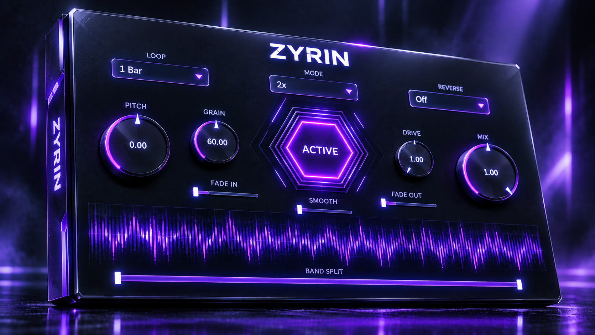

# ZYRIN
**Advanced granular time-stretching and pitch-shifting FX plugin designed for Drill, Pluggnb, New Jazz production but it works on any style or genre you throw on it :).**

## Overview
ZYRIN was engineered to bridge the gap between heavy low-end bounce and clinical DSP precision. It combines a state-of-the-art time-stretching core with a high-performance, hardware-accelerated cyberpunk aesthetic. Designed for modern producers, it delivers artifact-free pitch manipulation and rhythmic processing without compromising the transient impact or phase alignment of your foundational frequencies.

## Key Features
* **Time-Stretch Modes:** Selectable 1.5x (for musical 5th harmony/bounce), 2x (classic half-speed), and 4x (quarter-speed ambient) multipliers.
* **Dual-Mode Reverse:** Features a "Synced" mode (reverses gracefully within the DAW grid phase) and an "Instant" mode (immediate buffer traversal for glitch effects).
* **Loop Synchronization:** Deep DAW transport integration with configurable loop lengths from 1/16 notes up to 8 Bars.
* **Granular Control:** Independent Pitch Shifting (-12 to +12 semitones), Grain Size adjustment, and Transient Smoothing.
* **Seamless Transitions:** Adjustable Fade In and Fade Out parameters to guarantee click-free, musical activation and bypass.
* **Band Split:** 3-Way Linkwitz-Riley Crossover network to isolate the effect and preserve low-end phase alignment.
* **Visuals:** Real-Time Lock-Free Audio Oscilloscope and a BPM-Synced procedural reactor pulse.
* **Architecture:** 100% Lock-Free, Zero-Allocation Audio Thread built for zero-latency performance.

## Build Instructions
ZYRIN uses CMake for its build system. To configure and build the plugin from source, follow these steps:

1. Clone the repository and navigate to the project root.
2. Run the asset fetching script to bundle the custom typography required by the UI:
   ```bash
   python scripts/fetch_assets.py
   ```
3. Configure the CMake project:
   ```bash
   cmake -B build
   ```
4. Build the plugin:
   ```bash
   cmake --build build --config Release
   ```

The compiled plugin binaries will be located in the `build` directory, ready to be deployed to your system's VST3 or AU plugin folder.
